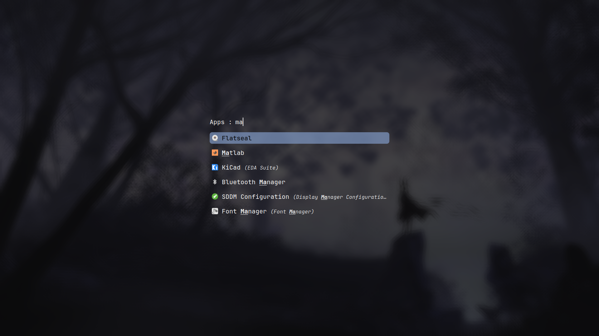

# HYPRLAND CONFIG

Dotfiles for [Hyprland Tiling Wayland Compositor](https://github.com/hyprwm/Hyprland). This is intended for **personal use**

These instructions written with Arch Linux using btrfs fike system with grub-bootloader.

# Hyprland Screenshots

### Rofi

# Installation tutorial from Base Arch install

1. First clone the repo by running the command: `git clone https://github.com/akash-g0807/Beta-Hyprland-config.git`
2. Then install yay (AUR helper):
    - cd into `Scripts` directory: `cd scripts`
    - Run `install_yay.sh`: `./install_yay.sh` 
3. Then install the packages by running install `install_pkg.sh`: `./install_pkg.sh`
4. cd into `Configs` directory (this command is from `Scripts` directory): `cd ../Configs`
5. Copy configs into `home` directory:
    - `cp -r .config ~/`
    - `cp -r .scripts ~/`
6. cd into `Themes_Icons` directory (this command is run from Configs directory): `cd ../Themes_Icons`
7. Copy `.themes` and `.icons` to `home` directory
    - `cp -r .thmes ~/`
    - `cp -r .icons ~/`
8. Restore symlinks
    - Go to the `Scripts` folder: `cd ../Scripts`
    - Run `restore_lnk.sh`: `./restore_lnk.sh`
9. Enable login manager: `systemctl enable sddm.service` and `systemctl start sddm.service`

Login and Enjoy!

# Post Installation (optional but reccommended)
1. Edit `~/.config/hypr/hyprland.conf` and change the screen res and other details to match your system
    - Also go to `~/.config/hypr/sleep_monitor.sh` and do the same

2. Install flatpak:
    - `sudo pacman -Syu flatpak`
    - Run `flatpak remote-add --if-not-exists --user flathub https://dl.flathub.org/repo/flathub.flatpakrepo`
    - Then `cd ~/.scripts` and run `./flatpak_file_override.sh` to give flatpaks access to `~/.themes` and `~/.icons`

3. Install `auto-cpufreq`:
    - `yay -S auto-cpufreq`
    - Enable systemd service: `systemctl enable --now auto-cpufreq.service`

4. Install TLP (refer to [Arch Wiki](https://wiki.archlinux.org/title/TLP) for more info):
    - `yay -S tlp-git tlp-rdw-git ethtool` (git version has given me a better time)
    - Enable/Start systemd service: `systemctl enable tlp.service` and `systemctl start tlp.service`
    - Mask rfkill service andd socket: `systemctl mask rfkill.service` and `systemctl mask rfkill.socket`
    - `systemctl enable NetworkManager-dispatcher.service` to use `tlp-rdw`     
    (if TLP gices any trouble please see Troubleshooting section)

- Enable bluetooth by running: `systenctl enable bluetooth.service` and `systemctl start bluetooth.service`
    - `blueman` is the graphical utility used for managing bluetooth devices

## To get `nwgbar` powerbuttons to work:
1. First go do `~/.config/nwg-launchers/nwgbar`
2. Run `install.sh`

# Software used here:
- [hyprland-git](https://github.com/hyprwm/Hyprland) - Wayland Tiling Compositor
- [sddm](https://github.com/sddm/sddm) - Login/Display Manager (using `-git` version found on [AUR](https://aur.archlinux.org/packages/sddm-git))
- [Kitty](https://github.com/kovidgoyal/kitty) - Default Terminal
- [Waybar](https://github.com/Alexays/Waybar) - Top Bar
- [Rofi](https://github.com/davatorium/rofi) - App Launcher
- [swww](https://github.com/Horus645/swww) - Wallpaper Daemon
- [swaync](https://github.com/ErikReider/SwayNotificationCenter) - Notification center/Daemon and Control Center
- [swaylock-effects](https://github.com/mortie/swaylock-effects) - Lock Screen
- [Thunar](https://gitlab.xfce.org/xfce/thunar) - File manager
- [Visual Studio Code (microsoft propietary one)](https://code.visualstudio.com/) - Code Editor (use the [AUR](https://aur.archlinux.org/packages/visual-studio-code-bin))
- [Clementine](https://www.clementine-player.org) - Music Player
- [Snapper](https://github.com/openSUSE/snapper) - Utility for managing filesysten snapshots and allows for easy rollbacks
- [btrfs-assistant](https://gitlab.com/btrfs-assistant/btrfs-assistant) - For helping with managing btrfs snapshots
- [wf-recorder](https://github.com/ammen99/wf-recorder) - Screen Recording
- [Grimblast](https://github.com/hyprwm/contrib) - Screenshot tool

(List not yet complete)

# Shortcuts Guide

## General Shortcuts
| Action                     | Shortcut            |
|----------------------------|---------------------|
| Open Terminal (Kitty)      | `SUPER + ENTER`     |
| Open Rofi Launcher         | `SUPER + SPACE`     |
| Open Rofi Power Menu       | `SUPER + H`         |
| Open wlogout               | `SUPER + P`         |
| Open nwgbar                | `SUPER + SHIFT + P` |
| Open File Manager (Thunar) | `SUPER + T`         |
| Open swaync control center | `SUPER + SHIFT + I` |
| Open nwg-drawer            | `SUPER + D`         |
| Open Wofi                  | `SUPER + R`         |

# Lock Screen
| Action                     | Shortcut            |
|----------------------------|---------------------|
| Lock Screen (swaylock)     | `SUPER + SHIFT + L` |

# Window Management
- Default Layout is Master and Stack Layout

| Action                | Shortcut                |
|-----------------------|-------------------------|
| Move Focus Up         | `SUPER + UP`            |
| Move Focus Down       | `SUPER + DOWN`          |
| Move Focus Left       | `SUPER + LEFT`          |
| Move Focus Right      | `SUPER + RIGHT`         |
| Fullscreen            | `SUPER + F`             |
| Move Window Up        | `SUPER + SHIFT + UP`    |
| Move Window Down      | `SUPER + SHIFT + DOWN`  |
| Move Window Left      | `SUPER + SHIFT + LEFT`  |
| Move Window Eight     | `SUPER + SHIFT + RIGHT` |
| Swap with next window | `SUPER + SHIFT + N`     |
| Resize Window Up      | `SUPER + CTRL + UP`     |
| Resize Window Down    | `SUPER + CTRL + DOWN`   |
| Resize Window Left    | `SUPER + CTRL + LEFT`   |
| Resize Window Right   | `SUPER + CTRL + RIGHT`  |
| Kill Active Window    | `SUPER + C`             |
| Toggle Floating       | `SUPER + V`             |
| Change Layout         | `SUPER + M`             |

## Dwindle Specific Shortcuts
| Action          | Shortcut                     |
|-----------------|------------------------------|
| Pseudo tile     | `SUPER + Q`                  |
| Toggle Split    | `SUPER + S`                  |
| Preselect Up    | `SUPER + CTRL + ALT + UP`    |
| Preselect Down  | `SUPER + CTRL + ALT + DOWN`  |
| Preselect Left  | `SUPER + CTRL + ALT + LEFT`  |
| Preselect Right | `SUPER + CTRL + ALT + RIGHT` |

## Master Stack Specific Shortcuts
| Action                                  | Shortcut            |
|-----------------------------------------|---------------------|
| Swap with Master                        | `SUPER + SHIFT + M` |
| Add to Master                           | `SUPER + A`         |
| Remove from Master                      | `SUPER + X`         |
| Cycle through Windows                   | `SUPER + J`         |
| Cycle through Windows in reverse        | `SUPER + K`         |
| Cycle through Master Layouts            | `SUPER + SHIFT + .` |
| Cycle through Master Layouts in reverse | `SUPER + SHIFT + ,` |
| Focus Master Window                     | `SUPER + CTRL + ,`  |

### Tabbed/Grouped Layout Shortcuts

- Works in both Master and Dwindle

| Action                                      | Shortcut              |
|---------------------------------------------|-----------------------|
| Toggle Group                                | `SUPER + G`           |
| Change active Window in group               | `SUPER + TAB`         |
| Change active Window in group in reverse    | `SUPER + SHIFT + TAB` |
| Lock Groups                                 | `SUPER + L`           |
| Move Window into group (in left direction)  | `SUPER + ALT + LEFT`  |
| Move Window into group (in right direction) | `SUPER + ALT + RIGHT` |
| Move Window into group (in down direction)  | `SUPER + ALT + DOWN`  |
| Move Window into group (in up direction)    | `SUPER + ALT + UP`    |
| Move Window out of group                    | `SUPER + ALT + M`     |

# Workspace Shortcuts

| Action             | Shortcut     |
|--------------------|--------------|
| Go to Workspace 1  | `SUPER + 1`  |
| Go to Workspace 2  | `SUPER + 2`  |
| Go to Workspace 3  | `SUPER + 3`  |
| Go to Workspace 4  | `SUPER + 4`  |
| Go to Workspace 5  | `SUPER + 5`  |
| Go to Workspace 6  | `SUPER + 6`  |
| Go to Workspace 7  | `SUPER + 7`  |
| Go to Workspace 8  | `SUPER + 8`  |
| Go to Workspace 9  | `SUPER + 9`  |
| Go to Workspace 10 | `SUPER + 0'` |

| Action                      | Shortcut            |
|-----------------------------|---------------------|
| Move Window to Workspace 1  | `SUPER + SHIFT + 1` |
| Move Window to Workspace 2  | `SUPER + SHIFT + 2` |
| Move Window to Workspace 3  | `SUPER + SHIFT + 3` |
| Move Window to Workspace 4  | `SUPER + SHIFT + 4` |
| Move Window to Workspace 5  | `SUPER + SHIFT + 5` |
| Move Window to Workspace 6  | `SUPER + SHIFT + 6` |
| Move Window to Workspace 7  | `SUPER + SHIFT + 7` |
| Move Window to Workspace 8  | `SUPER + SHIFT + 8` |
| Move Window to Workspace 9  | `SUPER + SHIFT + 9` |
| Move Window to Workspace 10 | `SUPER + SHIFT + 0` |

# Mouse Bindings

| Action                                      | Shortcut                     |
|---------------------------------------------|------------------------------|
| Move Window                                 | `SUPER + LEFT CLICK + DRAG`  |
| Resize Window                               | `SUPER + RIGHT CLICK + DRAG` |
| Move to next workspace                      | `SUPER + SCROLL DOWN`        |
| Move to previous work space                 | `SUPER + SCROLL UP`          |

# Screenshot and Screen Recording

## Screenshot

| Action                                                      | Shortcut                                        |
|-------------------------------------------------------------|-------------------------------------------------|
| Take screenshot of entire screen                            | `PRINT SCREEN`                                  |
| Take screenshot of entire screen and annotate (with swappy) | `SUPER + SHIFT + PRINT SCREEN`                  |
| Take screenshot of a particular area                        | `SUPER + SHIFT + S` and `DRAG`                  |
| Take screenshot of a particular Window                      | `SUPER + SHIFT + S`  and  `CLICK` on the window |

## Recording Screen

| Action                                                          | Shortcut                                         |
|-----------------------------------------------------------------|--------------------------------------------------|
| Record Entire Screen                                            | `SUPER + CTRL + PRINT SCREEN`                    |
| Record Particular Window                                        | `SUPER + CTRL + SHIFT + W` and `CLICK` on Window |
| Record particular area                                          | `SUPER + CTRL + SHIFT + S` + `DRAG`              |
| Stop Recording (applies when the either of the above is active) | `SUPER + CTRL + PRINT SCREEN`                    |

# Aknowledgements
Thank you [prashanthrangan](https://github.com/prasanthrangan) for install scripts I could use to make my install

# TLP Settings and Troubleshooting

- TLP suspends USB devices by default so to disable `USB_AUTOSUSPEND`:
    - Go to `/etc/tlp.conf`
    - Then find and type in `USB_AUTOSUSPEND=0`
- Sometimes TLP suspends bluetooth so to remedy this:
    - Go to `/etc/tlp.conf`
    - Then find and type in `USB_EXCLUDE_BTUSB=1`
        - If that does not work then edit grub parameters:
            - Go to `/etc/default/grub`
            - Find the line `GRUB_CMDLINE_LINUX_DEFAULT = "****"`
            - Append the following: `btusb.enable_autosuspend=0`
            - remake grub by: `sudo grub-mkconfig -o /boot/grub/grub.cfg`
                - If that does not work then just go to `/etc/tlp.conf` and add the following line: `DEVICES_TO_DISABLE_ON_BAT_NOT_IN_USE="wifi wwan"`

(If the above steps do not work then do the following:)

- Run command `lspci | grep -iE 'blu|usb'` and see the USB controllers
    - edit `tlp.conf` and replace the values in `RUNTIME_PM_DENYLIST`
    - replace the one found in `/etc/tlp.conf`
- If want to only siable autosuspend on specific device then use `lsusb` to get ID and then: `USB_DENYLIST = "****:**** ****:****"` Each successive entry is seperated by a space

# To Do
- Iron out bugs in light mode (Done)
- Make Light mode Colors consistent (Done)
- Add Light Mode button (Done)
- Make better scripts
- replace any instance of `~/home/akashg` with a more general `~/` to avoid errors and make script more general (Done I hope will lookout for more)
- Make a tutorial on how to use config (Started)
