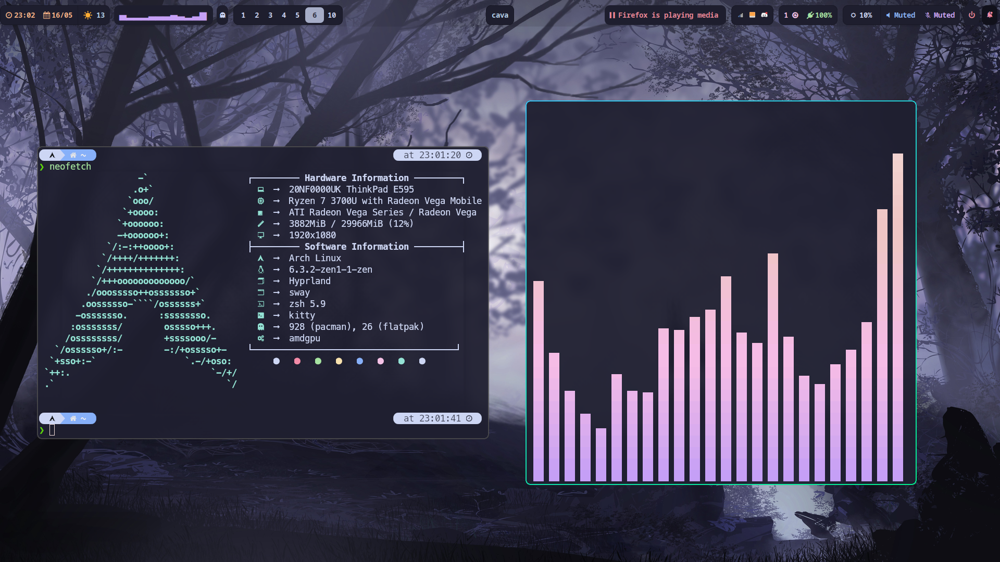
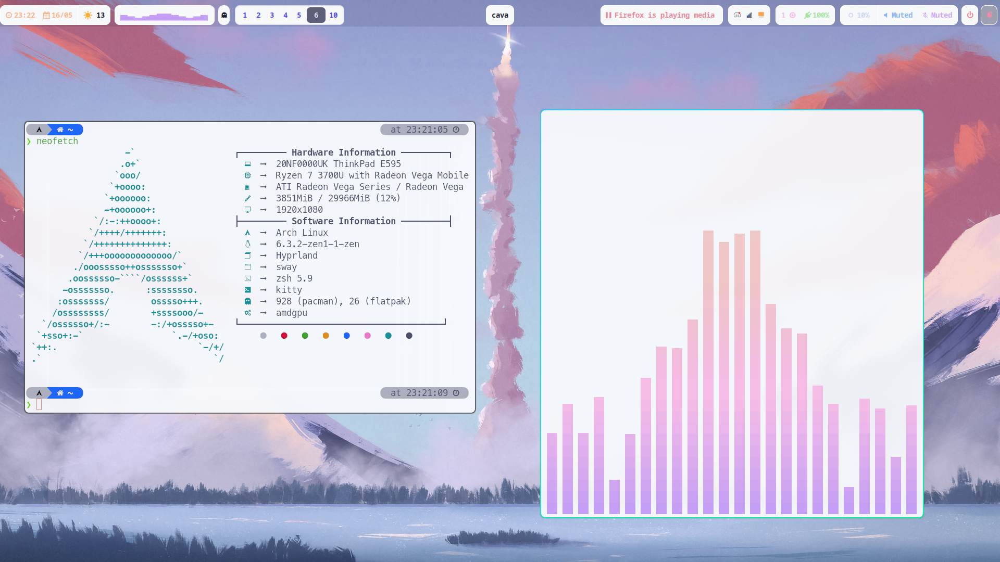

# DO NOT USE YET

# To Do
- Iron out bugs in light mode (Done)
- Make Light mode Colors consistent
- Make better scripts
- replace any instance of `~/home/akashg` with a more general `~/` to avoid errors and make script more general
- Make a tutorial on how to use config

# Shortcuts Guide

## General Shortcuts
| Action                     | Shortcut            |
|----------------------------|---------------------|
| Open Terminal (Kitty)      | `SUPER + ENTER`     |
| Open Rofi Launcher         | `SUPER + SPACE`     |
| Open Rofi Power Menu       | `SUPER + H`         |
| Open wlogout               | `SUPER + P`         |
| Open nwgbar                | `SUPER + SHIFT + P` |
| Open File Manager (Thunar) | `SUPER + T`         |
| Open swaync control center | `SUPER + SHIFT + I` |
| Open nwg-drawer            | `SUPER + D`         |
| Open Wofi                  | `SUPER + R`         |

# Lock Screen
| Action                     | Shortcut            |
|----------------------------|---------------------|
| Lock Screen (swaylock)     | `SUPER + SHIFT + L` |

# Window Management
- Default Layout is Master and Stack Layout

| Action                | Shortcut                |
|-----------------------|-------------------------|
| Move Focus Up         | `SUPER + UP`            |
| Move Focus Down       | `SUPER + DOWN`          |
| Move Focus Left       | `SUPER + LEFT`          |
| Move Focus Right      | `SUPER + RIGHT`         |
| Fullscreen            | `SUPER + F`             |
| Move Window Up        | `SUPER + SHIFT + UP`    |
| Move Window Down      | `SUPER + SHIFT + DOWN`  |
| Move Window Left      | `SUPER + SHIFT + LEFT`  |
| Move Window Eight     | `SUPER + SHIFT + RIGHT` |
| Swap with next window | `SUPER + SHIFT + N`     |
| Resize Window Up      | `SUPER + CTRL + UP`     |
| Resize Window Down    | `SUPER + CTRL + DOWN`   |
| Resize Window Left    | `SUPER + CTRL + LEFT`   |
| Resize Window Right   | `SUPER + CTRL + RIGHT`  |
| Kill Active Window    | `SUPER + C`             |
| Toggle Floating       | `SUPER + V`             |
| Change Layout         | `SUPER + M`             |

## Dwindle Specific Shortcuts
| Action          | Shortcut                     |
|-----------------|------------------------------|
| Pseudo tile     | `SUPER + Q`                  |
| Toggle Split    | `SUPER + S`                  |
| Preselect Up    | `SUPER + CTRL + ALT + UP`    |
| Preselect Down  | `SUPER + CTRL + ALT + DOWN`  |
| Preselect Left  | `SUPER + CTRL + ALT + LEFT`  |
| Preselect Right | `SUPER + CTRL + ALT + RIGHT` |

# Master Stack Specific Shortcuts
| Action                                  | Shortcut            |
|-----------------------------------------|---------------------|
| Swap with Master                        | `SUPER + SHIFT + M` |
| Add to Master                           | `SUPER + A`         |
| Remove from Master                      | `SUPER + X`         |
| Cycle through Windows                   | `SUPER + J`         |
| Cycle through Windows in reverse        | `SUPER + K`         |
| Cycle through Master Layouts            | `SUPER + SHIFT + .` |
| Cycle through Master Layouts in reverse | `SUPER + SHIFT + ,` |
| Focus Master Window                     | `SUPER + CTRL + ,`  |

## Tabbed/Grouped Layout Shortcuts

- Works in both Master and Dwindle

| Action                                      | Shortcut              |
|---------------------------------------------|-----------------------|
| Toggle Group                                | `SUPER + G`           |
| Change active Window in group               | `SUPER + TAB`         |
| Change active Window in group in reverse    | `SUPER + SHIFT + TAB` |
| Lock Groups                                 | `SUPER + L`           |
| Move Window into group (in left direction)  | `SUPER + ALT + LEFT`  |
| Move Window into group (in right direction) | `SUPER + ALT + RIGHT` |
| Move Window into group (in down direction)  | `SUPER + ALT + DOWN`  |
| Move Window into group (in up direction)    | `SUPER + ALT + UP`    |
| Move Window out of group                    | `SUPER + ALT + M`     |

# Mouse Bindings

| Action                                      | Shortcut                     |
|---------------------------------------------|------------------------------|
| Move Window                                 | `SUPER + LEFT CLICK + DRAG`  |
| Resize Window                               | `SUPER + RIGHT CLICK + DRAG` |
| Move to next workspace                      | `SUPER + SCROLL DOWN`        |
| Move to previous work space                 | `SUPER + SCROLL UP`          |

# Screenshot and Screen Recording

## Screenshot

| Action                                                      | Shortcut                                        |
|-------------------------------------------------------------|-------------------------------------------------|
| Take screenshot of entire screen                            | `PRINT SCREEN`                                  |
| Take screenshot of entire screen and annotate (with swappy) | `SUPER + SHIFT + PRINT SCREEN`                  |
| Take screenshot of a particular area                        | `SUPER + SHIFT + S` and `DRAG`                  |
| Take screenshot of a particular Window                      | `SUPER + SHIFT + S`  and  `CLICK` on the window |

## Recording Screen

| Record Entire Screen                                            | `SUPER + CTRL + PRINT SCREEN`                    |
| Record Particular Window                                        | `SUPER + CTRL + SHIFT + W` and `CLICK` on Window |
| Record particular area                                          | `SUPER + CTRL + SHIFT + S` + `DRAG`              |
| Stop Recording (applies when the either of the above is active) | `SUPER + CTRL + PRINT SCREEN`                    |

# Hyprland Screenshot

